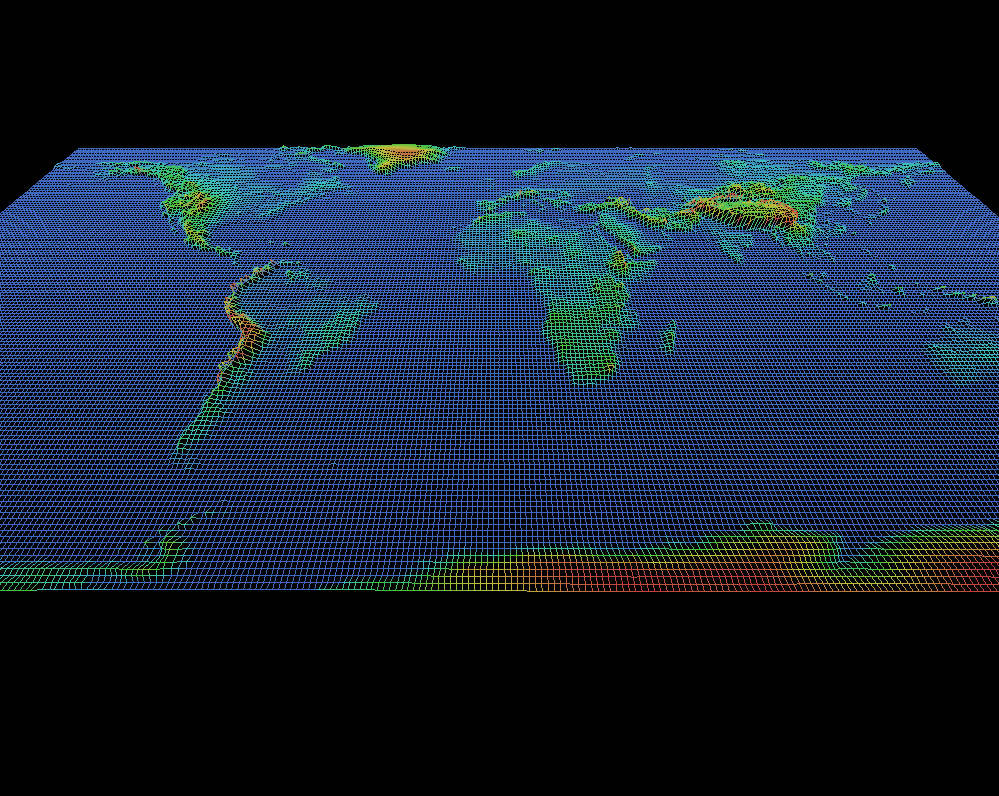

# FDF
## Description
A simple rendering application for displaying height maps using wireframes.
Supports isometric projection and perspective projection.

## Table of Contents
1. [Requirements](#installation)
2. [Installation](#requirements)
3. [Usage](#usage)
4. [Commands](#commands)

## Requirements
- **libbsd-dev**: Required for building the project on Linux

## Installation
### On Ubuntu
1. **Clone repository:**
```
git clone https://github.com/chalant/fdf.git
```
2. **Install dependencies:**
```
sudo apt-get install libbsd-dev
```
3. **Build project:**
```
make
```
### On Mac OS

1. **Clone repository:**
```
git clone https://github.com/chalant/fdf.git
```
2. **Build project:**
```
make
```
## Usage
```
./fdf [file-path]
```
## Example
```
./fdf test_maps/mars.fdf
```
## Commands
| **Action**                         | **Windows/Linux Shortcut** | **Mac Shortcut**        |
|------------------------------------|----------------------------|-------------------------|
| Toggle isometric/perspective       | `Ctrl + M`                 | `Cmd + M`               |
| Move up, down, left, right         | `W, S, A, D`               | `W, S, A, D`            |
| Zoom in/out                        | `+/-`                      | ``+/-``                 |
| Rotate Up, Down, Left, Right       | `↑, ↓, ←, →`               | `↑, ↓, ←, →`            |
| Increase/Decrease Height           | `Shift + Ctrl + ↑/↓`       | `Shift + Cmd + ↑/↓`     |
| Increase/Decrease Width            | `Shift + Ctrl + →/←`       | `Shift + Cmd + →/←`     |
| Increase/Decrease Height           | `Ctrl + →/←`               | `Cmd + →/←`             |
| Increase/Decrease Color separation | `Alt + ↑/↓`                | `Alt + ↑/↓`             |
| Rotate colors                      | `Alt + →/←`                | `Alt + →/←`             |
| Toggle height lightness on/off     | `Alt + L`                  | `Alt + L`               |
