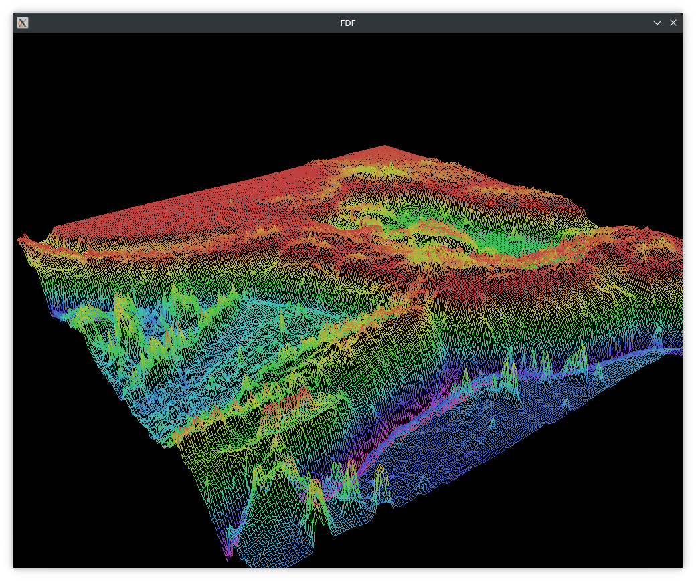

# FDF
## Description
A simple rendering application for displaying height maps using wireframes.
Supports isometric projection and perspective projection.

## Table of Contents
1. [Requirements](#installation)
2. [Installation](#requirements)
4. [Usage](#usage)

## Requirements
- **libbsd-dev**: Required for building the project on Linux

## Installation
### On Ubuntu
1. **Clone repository:**
```
git clone https://github.com/chalant/fdf.git
```
2. **Install dependencies:**
```
sudo apt-get install libbsd-dev
```
3. **Build project:**
```
make
```
### On Mac OS

1. **Clone repository:**
```
git clone https://github.com/chalant/fdf.git
```
2. **Build project:**
```
make
```
## Usage
```
./fdf [file-path]
```
## Example
```
./fdf test_maps/mars.fdf
```
